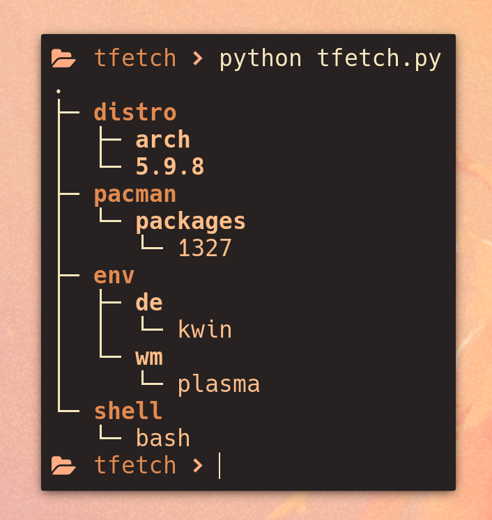

# tfetch

> your simple yet effetive tree style system fetch script.


## Installation Guide

1. Check Python Version:

Ensure you have Python correct Speficed in the ```pyproject.toml```. If not, install it from the [official Python website](https://www.python.org/).

2. Clone tfetch Repository:

Clone tfetch to your desired location.

``` bash
git clone https://github.com/EndOfLine-py/tfetch
```

3. Run Installation Script:

Once cloned, run the ```tfetch.py``` python script in the src folder

``` bash
cd src
python tfetch.py
```

4. Enjoy!

